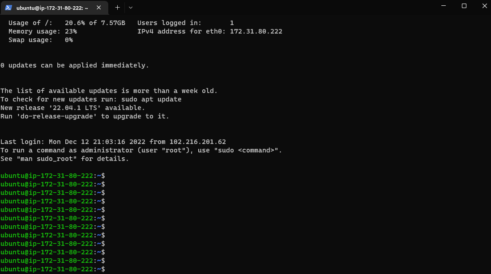

# LAMP Stack Implementation

## STEP 0

Launch a new EC2 instance with Ubuntu Server 20.04 LTS

Connect to the EC2 server by pasting the code into the terminal

`ssh -i "myFirstAWSkeyPair.pem" ubuntu@ec2-18-205-155-253.compute-1.amazonaws.com`

## STEP 1

Install Apache using Ubuntu's package manager 'apt'

`#update a list of packages in package manager`

`sudo apt update`

`#run apache2 package installation`

`sudo apt install apache2`

Verify that apache2 is running

`sudo systemctl status apache2`

Accessing server locally

`curl http://localhost:80`

## STEP 2

Install MySQL

`sudo apt install mysql-server`

Set password for root user and exit

`ALTER USER 'root'@'localhost' IDENTIFIED WITH mysql_native_password BY 'PassWord.1';`

Start interactive script, walk through the prompts and enter y for yes

`sudo mysql_secure_installation`

Log in to the MySQL console 

`sudo mysql -p`

## STEP 3

Install PHP

Run below code to install php, php-mysql (allows php communication with Mysql-based databases), and libapache2-mod-php (to enable apache handle php files)

`sudo apt install php libapache2-mod-php php-mysql`

## STEP 4 - CREATING A VIRTUAL HOST FOR YOUR WEBSITE USING APACHE

Create a directory for projectlamp 

`sudo mkdir /var/www/projectlamp`

Assign ownership of the direcoty with the current system user

` sudo chown -R $USER:$USER /var/www/projectlamp`

Create and edit a new config file in apache's sites-available directory

`sudo vi /etc/apache2/sites-available/projectlamp.conf`

Paste the config text

Enable the new virtual host

`sudo a2ensite projectlamp`

Disable default website that comes with apache

`sudo a2dissite 000-default`

Check for syntax error

`sudo apache2ctl configtest`

Reload apache

`sudo systemctl reload apache2`

Create an index.html file in the virtual host location

`sudo echo 'Hello LAMP from hostname' $(curl -s http://169.254.169.254/latest/meta-data/public-hostname) 'with public IP' $(curl -s http://169.254.169.254/latest/meta-data/public-ipv4) > /var/www/projectlamp/index.html`

Open the website url from a browser

`http://<Public-IP-Address>:80`

## STEP 5-ENABLE PHP ON THE WEBSITE

To change the order of index precedence, edit the dir.conf file

`sudo vim /etc/apache2/mods-enabled/dir.conf`

Reload apache

`sudo systemctl reload apache2`

Create a php script index.php to test that php is correctly configured

`vim /var/www/projectlamp/index.php`

Refresh the browser page

Remove script as it contains sensitive info about the server

`sudo rm /var/www/projectlamp/index.php`

### LAMP Stack Project Completed

